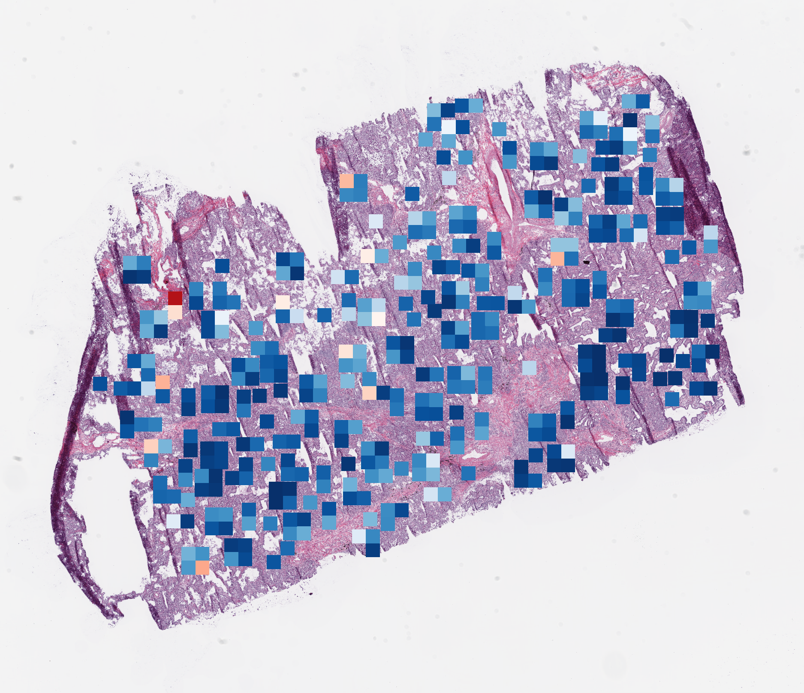

## Requirement

1. Python Environment: `pip install -r requirements.txt`

2. Install MMDetection following https://github.com/open-mmlab/mmdetection.
3. Install SLS code: `git clone https://github.com/ganjf/biomarkerPrediction.git`

3. Set the biomarker documentation with format following [TMB_CPTAC_LUAD.txt](https://drive.google.com/file/d/1uOb6-L5OaHRh8d3nFcnnJdJLqGuCTa6T/view?usp=sharing)

## Dataset Download

- TCGA: https://portal.gdc.cancer.gov/
- NLST: https://cdas.cancer.gov/datasets/nlst/
- CPTAC: https://www.cancerimagingarchive.net/

## Visualization

- TCGA-44-2666-01A-01-BS1(TMB = 23, TMB-High probability = 0.108)
  - 
- TCGA-44-8117-01A-01-BS1(TMB = 586, TMB-High probability = 0.869)
  - 

## How to run

### Tumor Search Module

1. Modify the source code.
    - ./subtypeDetection/inference/processSlideWindow.py
        - line 99-112: Set the contents of WSIs which need to be processed.
    - ./subtypeDetection/inference/makeDataset.py
        - line 45-46 and line 51-52: Set the mapping releationship between WSI name and patient id presented in Biomarker documentation.

2. Modify the executable of `subtypeTest.sh`.
    - ***--wsi_dir***: The content of WSIs in test set.
    - ***--patch_dir***: The content to store the patches (for detection) generated by fixed-size sliding window method. 
    - ***--biomarker_txt***: The path of biomarker documentation.
    - ***--inference_coco***: The test input for detector in COCO format, summarizing the ensembles of `$patch_dir`.
      
        > In cascade_rcnn.py
        > line 268: set 'ann_file' = `$inference_coco`
        >
        > line 269: set 'imp_predix' = `$patch_dir`
    - ***--detection_ckp***: The checkpoint for tumor search model.
    - ***--result_pkl***: The .pkl path to store detection results.
    - ***--roi_json***: The .json file to store the result after mapping detetcion results to the raw WSI.
    - *-**-roi_dir***: The content to store the post-processed tumor tissues.
    - ***--data_test***: The .csv file to summarize the ensembles of `$roi_dir`.
3. Run `bash subtypeTest.sh`

### ROB Search and Status Prediction Modules

1. Modify the source code.
    - ./TMB/ood_evaluate.py
        - line 50-51: Set the mapping releationship between WSI name and patient id presented in Biomarker documentation.
    - ./TMB/ood_screen.py
        - line 9-10, line 14-15, line 21-22 and line 36-37: Set the mapping releationship between WSI name and patient id presented in Biomarker documentation.
    - ./TMB/cls_evaluate.py
        - line 49-50: Set the mapping releationship between WSI name and patient id presented in Biomarker documentation.

2. Modify the executable of `biomarkerTest.sh`
    - ***--data_dir***: The content of the post-processed tumor tissues (as `$roi_dir`).
    - ***--biomarker_txt***: The path of biomarker documentation.
    - ***--input_test***: The .csv file to summarize the post-processed tumor tissue associated to the patients in test set.
    - ***--confidence_ckp***: The checkpoint for ROB search model.
    - ***--biomarker***: The choices of ['TMB', 'CD274', 'CD8A', 'TP53']
    - ***--confidence_threshold***:  The threshold to perform ROB searching, default=55(%).
    - ***--biomarker_threhold***: The threshold to determine the status of biomarker as high/positive.
    - ***--confidence_input_test***: The .csv file to store the biomarker predictions and confidence scores from ROB search module.
    - ***--confidence_output_test***: The .csv file to summarize the screened-out ROBs from ROB search module.
    - ***--cls_ckp***: The checkpoint for status prediction model.
3. Run `bash biomarkerTest.sh >> test.log`

